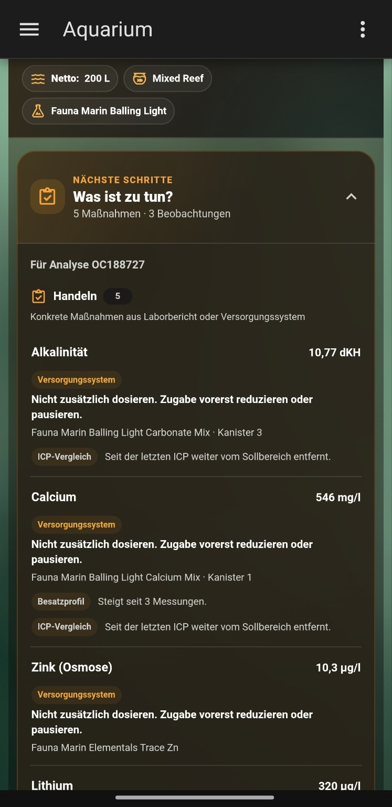
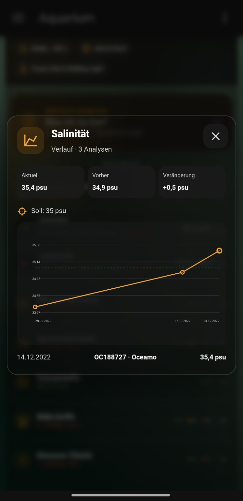
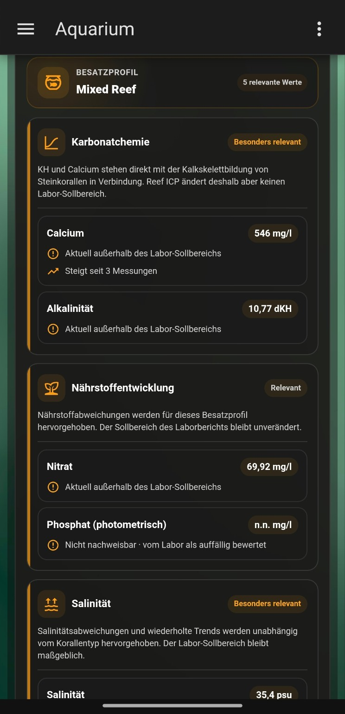
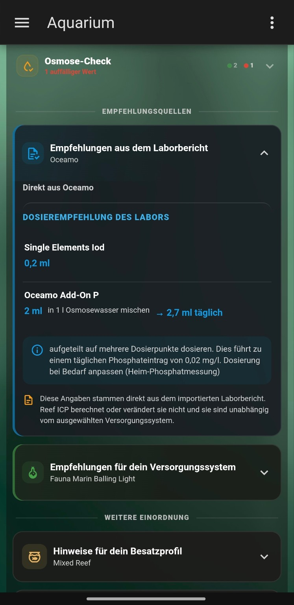
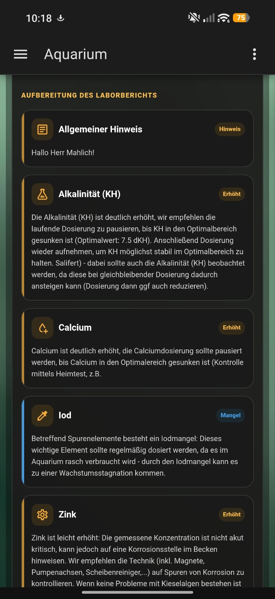

<p align="center">
  
</p>

# Reef ICP for Home Assistant

A custom Home Assistant integration for importing reef-aquarium ICP analysis reports from multiple laboratory providers.

> **Status:** Stable release · v1.0.0

## Screenshots

Reef ICP turns laboratory reports into a complete aquarium analysis workspace inside Home Assistant — combining measurements, trends, laboratory guidance, stocking-profile context and dosing-system recommendations.

<p align="center">
  
</p>

<p align="center">
  <strong>Everything important at a glance</strong><br>
  The latest ICP analysis, overall status, previous report, aquarium profile,
  selected supply system and all measurement categories in one dashboard.
</p>

<br>

<table>
  <tr>
    <td align="center"><strong>Action plan</strong></td>
    <td align="center"><strong>Interactive history</strong></td>
  </tr>
  <tr>
    <td align="center"></td>
    <td align="center"></td>
  </tr>
  <tr>
    <td align="center">Reef ICP combines relevant findings into a compact list of actions and observations while keeping the original recommendation sources separate.</td>
    <td align="center">Follow measurements across multiple analyses with previous values, changes, target values and long-term trends.</td>
  </tr>
</table>

<br>

<table>
  <tr>
    <td align="center"><strong>Supply-system recommendations</strong></td>
    <td align="center"><strong>Laboratory recommendations</strong></td>
  </tr>
  <tr>
    <td align="center"></td>
    <td align="center"></td>
  </tr>
  <tr>
    <td align="center">Provider-independent recommendations are mapped to the selected aquarium supply system, including individual-element corrections where supported.</td>
    <td align="center">Recommendations contained in the original laboratory report remain visible separately and are never silently replaced by Reef ICP calculations.</td>
  </tr>
</table>

<br>

<p align="center">
  
</p>

<p align="center">
  <strong>Stocking-profile-aware interpretation</strong><br>
  Reef ICP can highlight measurements and trends that are especially relevant
  for the selected aquarium profile while preserving the laboratory's original
  reference ranges and status.
</p>

> Screenshots show a development installation containing test reports. Displayed measurements, recommendations and dosing amounts are examples only and are not general dosing instructions.

## Supported providers

### Oceamo

- Classic Oceamo ICP PDF format
- Oceamo **Reef ICP-MS** / ICP-MS analysis-report format
- Automatic distinction between classic reports (`classic_icp`) and ICP-MS reports (`reef_icp_ms`)
- German classic and English ICP-MS headings / metadata
- Cross-report normalization of English ICP-MS names such as `Boron`, `Potassium`, `Sodium`, `Iodine`, `Copper` and `Tungsten` to the existing Reef ICP analytes
- ICP-MS-only / extended parameters such as SAK/SAC254, Cäsium, Cer, Gallium, Ruthenium, Thorium, Tellur, Neodym and Hafnium when present in the supplied report
- Report metadata and sample timestamp
- Measurements and target values
- Oceamo rating artwork from both classic and current ICP-MS layouts, including multiple icon sizes, with conservative range/limit fallback when artwork cannot be classified
- `n.n.` and `n.b.` without converting them to zero
- Interpretation and product recommendation text when present

The ICP-MS parser is designed around Oceamo's publicly documented current parameter set and public English-format analysis-report examples, including the `MSR...` report family. Public reports **MSR229115** and **MSR234022** were used as format/value references for this development step.

### Fauna Marin

- Tested Fauna Marin Reef ICP one-page PDF format
- Sample ID, sample date, received date, aquarium volume and sample location
- Macro elements, nutrients, trace elements and potential pollutants
- Reference ranges
- `n.n.` and `n.g.`
- Per-parameter Elementals dosage recommendations
- Water-change recommendations
- Unit normalization for comparable cross-provider history

The Fauna Marin parser has been tested against four real reports from 2022.

### ATI

- Current ATI laboratory PDF layout
- Automatic recognition using ATI-specific PDF fingerprints
- Analysis ID, barcode, aquarium name, volume, reason and laboratory dates
- Basis values, major elements, trace elements, nutrients and pollutants
- ATI ideal values and textual laboratory assessments
- ATI `---` non-detect values are preserved as non-numeric results
- ATI `TOP`, `WENIG`, `ERHÖHT`, `ZU HOCH`, `Achtung` and `Kritisch` assessments are normalized to Reef ICP status levels
- Comparable concentrations are normalized to the shared cross-provider units
- Recommended-action and dosing text is preserved for later card display

The ATI parser has been developed against a real public current-format ATI report from 2026 (analysis ID **372482**). Older ATI layouts and the newer Pro / Ultimate-MS variants remain separate compatibility targets until representative PDFs are available.

### TRITON

- Tested legacy TRITON ICP-OES PDF table formats from **2014 and 2015**
- Automatic recognition of both tested legacy dosing-header variants
- 32 analytes in the 2014 report and 33 analytes in the 2015 report
- Set points, deviations and aquarium volume
- Reads the green / yellow / red **Warnampel** directly from the PDF drawing stream
- Preserves legacy TRITON dosing recommendations per analyte
- Supports both `Einmalige / Tägliche Dosierung` and `Korrektur / Erhaltungs Dosierung` layouts
- Normalizes comparable analytes into the shared Reef ICP history
- Uses the printed TRITON report ID when present (for example `296B`); otherwise generates a stable provider-local ID
- Uses a trustworthy date from the report itself when available
- Can fall back to a parsed sample date or a plausible date embedded in the PDF filename
- Deliberately ignores PDF `CreationDate` metadata because it can represent the export time rather than the laboratory analysis date
- If no trustworthy date remains, the Home Assistant import flow asks for the analysis date instead of rejecting the PDF

The currently supported TRITON family is explicitly treated as `triton_legacy_icp`. It has been tested against two real two-page German TRITON ICP-OES reports from 2014 and 2015. Current TRITON reports may use a different layout and remain a separate compatibility target until a representative modern result is available.

### Tropic Marin

- Automatic recognition of the current **Tropic Marin ICP Water Analysis** PDF family
- Standard **ICP Water Analysis** (`icp_water_analysis`) and **ICP Water Analysis Plus** (`icp_water_analysis_plus`) report types
- Sample ID, aquarium name, aquarium volume, sample date and laboratory receipt date
- Stable provider report ID from the Tropic Marin analysis URL when present
- Basic physical and chemical values such as conductivity, density, salinity, pH and alkalinity when supplied by the report
- Major elements / halogens, nutrients, trace elements and potential pollutants
- Tropic Marin `Ideal`, `increase` and `lower` recommendations normalized to Reef ICP status levels while preserving the original laboratory assessment
- Product hints from the Block Analysis System and Components recommendations are preserved as laboratory-provided text
- `n.n.` and `n.g.` remain non-numeric and are never converted to zero
- Comparable values such as iodine, ICP phosphorus and silicon are normalized to the shared Reef ICP units for cross-provider history
- Relative-value tables are preserved as report metadata instead of being mixed into the normal analyte history
- **ICP Water Analysis Plus** can additionally import its RO / osmosis-water measurements into the existing `osmosis` category
- Osmosis-water entities use an `(Osmose)` suffix in Home Assistant so they are clearly distinguishable from the aquarium measurements

The parser was developed against four public Tropic Marin report examples: analyses **11140**, **11498**, **11827** and **14278**. Report **11140** represents the Plus layout; the other three represent the standard layout. Reef ICP only labels a report as Plus when an explicit product-title marker can be extracted. It deliberately does not infer Plus from page count, conductivity or the presence of an osmosis-water section.

## Provider and report type

Reef ICP stores the laboratory provider separately from a report-type hint. This prepares the integration for different analysis products from the same laboratory, for example classic Oceamo ICP versus **Oceamo Reef ICP-MS**, without treating them as different providers.

Current report-type hints include `classic_icp`, `reef_icp_ms`, `reef_icp`, `ati_icp`, `triton_legacy_icp`, `icp_water_analysis` and `icp_water_analysis_plus`. Future parsers can add further types such as ATI Ultimate-MS while keeping the same provider-neutral history model.

## Aquarium profile

Reef ICP separates the aquarium itself from the laboratory that performs an ICP.

Each aquarium can now store:

- **Net water volume** in liters
- **Stocking profile**
- **Dosing / supply system**, independent of the ICP laboratory
- Optional **personal target ranges** for salinity, alkalinity, calcium and magnesium

Stocking-profile presets currently include **Mixed Reef**, **SPS-dominant**, **LPS-dominant**, **Soft-coral dominant**, **Fish Only** and **Other / custom**.

The stocking profile is intentionally metadata-only in version `0.11.7`: Reef ICP stores it, exposes it on the `ICP Status` sensor and shows it in the dashboard card, but it does **not** yet alter laboratory status, target ranges or dosing calculations.

Built-in presets currently include **Fauna Marin Balling Light**, **ATI Essentials pro**, **TRITON Method**, **Oceamo DUO** and **Tropic Marin Original Balling**. An aquarium can also use **Other / custom** with a separate custom system name, or be set to analysis-only mode.

Starting with version `0.13.6`, the aquarium profile is created independently of laboratory data. A new aquarium therefore does **not** require an ICP report. The first analysis can be imported immediately or at any later time through **Configure → Import ICP analyses**.

These settings remain attached to the aquarium when reports from Oceamo, Fauna Marin, ATI, TRITON, Tropic Marin or future providers are imported. Existing aquariums can edit the profile through **Configure → Aquarium settings**.

### Personal aquarium target ranges

Starting with version `0.13.5`, an aquarium can optionally define its own operating ranges for:

- **Salinity**
- **Alkalinity (KH)**
- **Calcium**
- **Magnesium**

The feature is deliberately opt-in. By default Reef ICP continues to use the target/reference range supplied by each imported ICP report.

Personal targets are stored as an aquarium setting, not as a modification of the laboratory result. The original laboratory target and laboratory status remain preserved in every report. The bundled card shows **Your target** and **Lab** separately when a personal range is active.

A personal target can be configured for only one or some of the four parameters. Leaving both minimum and maximum empty for one parameter keeps that parameter on the laboratory target.

Supply-system correction calculations use the personal range for these four parameters when one is configured. Direct recommendations imported from the laboratory report remain laboratory recommendations and are never rewritten to match the personal aquarium target.

Personal targets do not apply to osmosis / RO-water measurements.

The dashboard separates unknown laboratory results into **Not detectable**, **Not determined** and **Other unclear** instead of combining all unknown states into one counter.

To keep provider-specific report layouts from filling the card with permanent grey placeholders, a parameter that has been **not determined in every stored ICP** is hidden from the main card. If that parameter was determined at least once anywhere in the aquarium history, it remains visible when a later report says **Not determined**. A laboratory `n.n.` / **Not detectable** result is a real analytical result and is therefore never hidden by this rule.

This is the foundation for a provider-independent recommendation engine: laboratory measurements stay normalized by Reef ICP, while dosing recommendations can be generated for the aquarium's chosen supply system, net water volume and optional personal operating targets rather than blindly copying the laboratory's product recommendations.

## Action plan and configurable card sections

Starting with version `0.13.0`, Reef ICP can build a compact `action_plan` from guidance that already exists elsewhere in the integration.

The action plan may group, per analyte:

- direct dosing or water-change instructions parsed from the laboratory report,
- correction / reduce / pause guidance from the selected supply system,
- stocking-profile attention signals,
- newly abnormal or worsening changes since the previous ICP.

The plan does **not** create a second dose. Laboratory instructions and Reef ICP supply-system calculations remain separate and are labeled by source. If both sources provide an action for the same analyte, the card warns the user not to add the doses together.

From version `0.13.1`, the card separates the plan into:

- **Act**: concrete laboratory or supply-system actions,
- **Observe**: worsening comparison signals and repeated numeric trends that do not carry their own dosing instruction.

Plain stocking-profile relevance is intentionally not repeated in the action plan. It stays in the dedicated **Stocking profile insights** panel unless the profile contributes a repeated up/down trend.

Example backend structure:

```yaml
action_plan:
  analysis_number: 074421I
  items:
    - key: iod
      name: Iod
      actions:
        - source: laboratory
          action: dose
          amount_ml: 2.8
          days: 2
        - source: supply_system
          action: correction_dose
          dose_amount: 2.268
          dose_unit: ml
      multiple_action_sources: true
  action_items:
    - key: iod
  review_items:
    - key: alkalinitaet
```

### Card visibility controls

The Reef ICP card uses Home Assistant's graphical card configuration form. Under **Additional sections**, each optional collapsible panel can be enabled or disabled separately:

- Action plan
- Since the previous ICP
- Stocking-profile insights
- Laboratory recommendations
- Supply-system recommendations
- Laboratory interpretation

All sections default to enabled. Existing cards remain compatible because missing visibility options are interpreted as enabled.

The separate **Show previous ICP** option still controls the previous-analysis comparison shown inside measurement rows and in the card header.

## Stocking-profile insights

Starting with version `0.12.0`, the stored stocking profile can add a separate context layer to the dashboard.

This layer is deliberately **not another laboratory status system**. It does not replace or recalculate imported target ranges. Instead, Reef ICP can bring a small set of already-measured chemistry areas to the user's attention based on the selected aquarium profile.

Current profile-aware contexts are intentionally conservative:

- **Carbonate chemistry**: alkalinity and calcium
- **Nutrients**: nitrate plus supported phosphate / phosphorus measurements
- **Salinity**

For example:

- an **SPS-dominant** aquarium can give extra attention to carbonate chemistry, salinity and repeated nutrient trends,
- an **LPS-dominant** or **Mixed Reef** aquarium keeps carbonate chemistry and salinity prominent while treating nutrient deviations more contextually,
- **Soft-coral dominant** and **Fish Only** profiles do not receive an extra stony-coral calcification priority for alkalinity/calcium.

The result is exposed on the `ICP Status` sensor as:

```yaml
stocking_profile_insights:
  profile: sps_dominant
  mode: context_only
  items:
    - key: alkalinitaet
      context: carbonate
      attention: high
      current_issue: true
```

The bundled card renders these values in a separate **Stocking profile insights** panel.

From version `0.12.1`, profile hints are grouped by context so shared explanatory text is shown only once per chemistry area. Individual analyte rows remain compact.

Profile insights also distinguish between a real numeric target comparison and a non-numeric laboratory result. For example, `n.n.` can be shown as **not detectable and flagged by the laboratory**, but Reef ICP does not claim that a non-detect has a calculable distance outside a numeric target range.

### Important limitations

`SPS` and `LPS` are practical aquarium-husbandry labels, not strict scientific taxonomic groups. Coral responses also differ by species, light, feeding, nutrient balance, carbonate chemistry and many other factors.

Reef ICP therefore does **not** apply fixed rules such as:

```text
SPS target = X
LPS target = Y
```

and does not apply profile multipliers to dosing.

The profile is used only to prioritize attention. Laboratory target ranges, normalized Reef ICP status and supply-system recommendations remain separate.

### Scientific basis for the first profile rules

The first rules are intentionally narrow and are based on broad physiological principles rather than hobby folklore:

- Stony corals form calcium-carbonate skeletons, and calcium plus carbonate-system chemistry are fundamental to calcification:  
  https://pmc.ncbi.nlm.nih.gov/articles/PMC3159950/
- Experimental work in *Acropora cervicornis* shows calcification and linear extension responding to alkalinity manipulation, but it does not establish one universal aquarium alkalinity target for all SPS:  
  https://pmc.ncbi.nlm.nih.gov/articles/PMC13150020/
- Nutrient effects are not a simple “lower is always better” rule. Experimental and review work shows that nitrogen/phosphorus concentration and balance can alter coral growth, calcification and skeletal properties in different directions depending on context and species:  
  https://pmc.ncbi.nlm.nih.gov/articles/PMC10276130/  
  https://pmc.ncbi.nlm.nih.gov/articles/PMC10468396/
- Soft corals can form calcitic skeletal elements (sclerites), which is one reason Reef ICP deliberately avoids treating soft-coral systems as biologically independent of calcium-carbonate chemistry:  
  https://pmc.ncbi.nlm.nih.gov/articles/PMC3173117/

These references support the **context categories**, not a new set of Reef ICP target ranges.

## Latest-analysis changes and repeated trends

Starting with version `0.11.8`, Reef ICP can summarize what changed since the previous imported ICP without altering the laboratory data.

The `ICP Status` sensor exposes an `analysis_insights` payload with:

- values that newly move outside the current target range,
- values that return to the current target range,
- values that move closer to or further from the current target range,
- repeated numeric measurement trends across stored reports.

For the latest-vs-previous comparison, Reef ICP deliberately evaluates **both numeric values against the current report's normalized target definition**. It does not compare two laboratories' warning/critical labels directly, because providers can use different classifications and reference ranges. Non-numeric states such as `n.n.`, `n.g.`, `n.b.` or ATI `---` are not assigned a target-distance improvement/worsening judgment.

A repeated trend is created only after at least **three numeric measurements** of the same normalized analyte and unit move consecutively in one direction. For example, an iodine value that falls across three stored measurements can be shown as a repeated downward measurement trend.

These trends are deliberately descriptive. A rising or falling concentration is **not automatically classified as good or bad**. Biological interpretation depends on the analyte, target, aquarium context and later evidence-based stocking-profile logic.

The bundled dashboard card shows this information in a separate **Since the previous ICP** panel. Up to eight current repeated trends are shown, prioritizing parameters with warning or critical status.

## Supply-system recommendations

Reef ICP keeps the laboratory interpretation separate from the aquarium's own supply system. The ICP provider can therefore change while recommendations continue to follow the products actually used on the aquarium.

Starting with version `0.10.0`, the recommendation engine supports:

- **Fauna Marin Balling Light** core corrections plus a broad set of **Fauna Marin Elementals / Elementals Trace** single-element corrections, including Elementals Trace Se for selenium.
- **ATI Essentials pro** with **ATI ICP Elements** for provider-independent correction of major, minor and trace-element deficiencies.
- **Oceamo DUO** with numeric DUO-KH correction plus **Oceamo Single Elements** for supported individual deficiencies.
- **TRITON Method / Core7 Flex** as an official-calculator workflow. Reef ICP identifies the deficient TRITON single element and links to TRITON's own calculator instead of copying an unpublished product concentration.
- **Tropic Marin Original Balling** with manufacturer-based numeric corrections for **Calcium / Part A** and **Alkalinity (KH) / Part B**. The implementation uses the published prepared-solution reference of 50 ml per 100 l for +10 mg/l calcium or +1.4 dKH, respects the published maximum dose, and keeps Part C as the ionic-balance component rather than treating it as an independent magnesium correction.

Examples of automatically calculated single-element corrections include iodine, fluoride, molybdenum, manganese, lithium, potassium, boron, strontium and additional supported analytes depending on the selected supply system.

The calculation uses:

1. the aquarium's stored **net water volume**,
2. the normalized current ICP value,
3. the aquarium's personal target range for salinity / KH / calcium / magnesium when configured, otherwise the target value/range in the imported report, and
4. the published manufacturer strength of the selected product.

When the manufacturer publishes a maximum daily increase, Reef ICP also calculates a minimum number of dosing days and an approximate amount per day. If no official daily limit is available in the implemented source data, the card deliberately shows only the total correction and warns against interpreting it as an automatic one-time dose.

Calculated amounts are **correction doses**, not permanent daily maintenance doses. Balling Light, ATI Essentials pro, Oceamo DUO, TRITON Core7 and Tropic Marin Original Balling remain consumption-driven systems for ongoing daily dosing.

Manufacturer formulations can change. Reef ICP therefore surfaces the manufacturer source used for each recommendation and users should confirm the current product label before dosing.

For **Fauna Marin Elementals Trace Se**, Reef ICP uses the published strength of **1 ml per 100 l for +0.5 µg/l selenium** and Fauna Marin's published maximum daily increase of **+1 µg/l**.

### ICP-MS-only corrections

Some ultra-trace corrections require a sufficiently sensitive analytical method. Reef ICP can enforce that requirement per product rule instead of calculating from an unsuitable report.

For **Oceamo Single Elements Selen**, Reef ICP uses Oceamo's published strength of **1 ml per 100 l for +0.05 µg/l** and maximum daily increase of **+0.05 µg/l**, but only calculates an upward correction from an **Oceamo Reef ICP-MS** report (`reef_icp_ms`). Oceamo states that the recommended selenium range is below the reliable detection limit of ICP-OES. A low selenium result from another report type therefore shows an ICP-MS requirement instead of a dose.

## Multi-provider history

Reports from different providers can be stored in the same aquarium.

Comparable analytes are normalized to the same internal key, category and unit. This allows a history such as:

```text
Fauna Marin → Fauna Marin → Oceamo → Oceamo ICP-MS
```

to appear in one Home Assistant long-term statistic and in the bundled history chart.

Examples of normalization:

- Fauna Marin iodine: `mg/l` → `µg/l`
- Fauna Marin ICP phosphorus: `mg/l` → `µg/l`
- Fauna Marin silicon: `mg/l` → `µg/l`
- Fauna Marin `Brom` is normalized to the shared `Bromid` analyte

Measurements that are not directly comparable remain separate. For example, Fauna Marin elemental sulfur is not merged with Oceamo sulfate.

## Importing ICP reports

Open **Settings → Devices & services → Reef ICP → Configure → Import ICP analyses** to add more reports to an existing aquarium.

Reef ICP uses a **batch import flow**. Home Assistant's native file selector still accepts one PDF at a time, but you can prepare several reports without leaving the import dialog:

1. Upload one ICP PDF.
2. Reef ICP detects the laboratory automatically.
3. Confirm or override the detected provider. If required, select the missing analysis date.
4. The confirmed report is added to a temporary import list.
5. Choose **Add another ICP** to repeat the process or **Finish import** to store the complete batch.

Aquarium creation and ICP import are separate starting with version `0.13.6`. Create the aquarium profile first, then open **Configure → Import ICP analyses** whenever you want to add the first report or import an existing history. The batch importer can prepare several reports in one session.

A single batch may contain reports from **different supported laboratories**. Each PDF is detected and validated independently. The final batch is sorted chronologically before it is stored.

If a report in the batch has the same provider and provider report ID as another queued or already stored report, Reef ICP uses the existing upsert rules and keeps one report for that identity. Replacing an already stored report also requests the existing long-term-statistics rebuild so stale recorder points are removed.

The selected provider parser validates every PDF again. A manual override therefore does not force an incompatible report into the wrong parser: if the PDF does not match the selected laboratory, that report does not enter the batch.

Currently detected automatically:

- Oceamo
- Fauna Marin
- ATI
- TRITON (tested legacy ICP-OES format)
- Tropic Marin (ICP Water Analysis / ICP Water Analysis Plus)

If no supported provider can be identified, the current PDF import stops instead of guessing. Already confirmed reports in the same batch remain queued. Date handling is provider-independent: Reef ICP first uses a date parsed from the report, then a parsed sample date or a plausible filename date. PDF `CreationDate` metadata is not treated as an analysis date. If no trustworthy date remains, Reef ICP opens a native Home Assistant date selector.

## Analysis date handling

Reef ICP applies the same date rules to every supported laboratory:

1. Use the provider-specific analysis/report date when it is present in the PDF.
2. If the report has no separate analysis date but does contain a parsed sample timestamp, use that sample date as the chronological report date.
3. Otherwise, use a plausible calendar date embedded in the original PDF filename.
4. If none of those sources is available, Home Assistant asks you to select the date manually.

PDF `CreationDate` metadata is deliberately ignored. It describes when a PDF file was created or exported and is not guaranteed to match the laboratory analysis or sampling date.

A manually selected date is stored with `analysis_date_source: manual`.

## What it currently does

- Install as a HACS custom repository
- Add **Reef ICP** under **Settings → Devices & services**
- Create an aquarium profile with net water volume, a persistent stocking profile, a dosing/supply system and optional personal Salinity/KH/Ca/Mg target ranges
- Import ICP PDFs directly in Home Assistant
- Create an aquarium before any ICP report exists, then import analyses later through Configure
- Prepare and import several ICP reports in one batch through Configure
- Mix supported providers inside the same import batch while validating every PDF separately
- Confirm or override the automatically detected ICP provider before a report enters the batch
- Store up to 100 reports per aquarium
- Keep reports in chronological sample order
- Keep the newest report as the current sensor state
- Keep one stable sensor per analyte seen in any stored report
- Preserve the newest available analyte result when a later provider omits that parameter
- Create `ICP Status`, `Analysis date` and `Analysis number` sensors
- Preserve non-numeric laboratory states instead of converting them to zero
- Import historic numeric values as Home Assistant external long-term statistics
- Compare the newest ICP with the immediately previous stored ICP
- Combine comparable values from different providers in the same history
- Bundle and automatically load the **Reef ICP Card**
- Open an interactive history chart by tapping a measurement
- Show the provider for the current report, previous report and selected history points
- Label Oceamo ICP-MS reports as `Oceamo · ICP-MS` in the dashboard/history source display

## Current entities

An aquarium can exist without an ICP report. In that state the config entry and aquarium settings are available, but no ICP sensor entities are created yet.

After the first ICP is imported, the integration creates:

- `ICP Status`
- `Analysis date`
- `Analysis number`
- one stable sensor for every analyte that has appeared in any stored report

`ICP Status` contains the complete normalized measurement list, provider metadata, previous-analysis comparison, stored-report summary and statistic IDs used by the bundled card.

### Stable measurement entities across providers

Different laboratories do not always test the same parameter set. Starting with version `0.6.1`, individual measurement entities therefore remain stable across provider changes.

If the newest ICP omits an analyte entirely, the sensor keeps the newest available result from the most recent older report that actually contained that analyte. The sensor exposes `included_in_current_report: false` plus `last_measured_*` and `current_*` attributes so the source of the value remains explicit.

This fallback only applies when the parameter is absent from the newest report. If the newest report contains the analyte but reports `n.n.`, `n.b.`, `n.g.` or ATI `---`, that laboratory result remains current and Reef ICP does not substitute an older numeric value.

The `ICP Status` entity and Reef ICP dashboard card continue to show only measurements that are actually present in the newest report. Carried-forward values therefore never appear as fresh measurements in the main ICP card.

## Fauna Marin recommendations

Where present in the PDF, Fauna Marin measurement attributes can contain a structured recommendation.

Example dosage:

```yaml
recommendation:
  type: dose
  amount_ml: 2.7
  days: 2
  product: Elementals Trace I
```

Example water-change recommendation:

```yaml
recommendation:
  type: water_change
  product: Elementals Trace Ba
```

These are imported as laboratory-provided recommendations. Reef ICP does not currently control dosing equipment.

## Laboratory recommendations in the dashboard card

Reef ICP keeps laboratory instructions visually separate from its own supply-system calculations.

When the imported PDF contains recommendation data, the card adds a collapsed **Recommendations from the laboratory report** panel below the measurements. Depending on the laboratory format, it can show:

- Fauna Marin row-level dosage recommendations with the analyte, amount, duration and named Elementals product
- Fauna Marin water-change recommendations and the product named in the report
- legacy TRITON correction/one-time and maintenance/daily dosing values, including the report aquarium volume when available
- Oceamo or ATI report-level product recommendation text when the PDF contains such a section

These values are displayed as imported laboratory information. Reef ICP does not recalculate them. The separate **Recommendations for your supply system** panel remains the provider-independent Reef ICP calculation based on the aquarium's stored net volume and selected dosing system.

For the frontend, Reef ICP also exposes a dedicated `laboratory_recommendations` payload on the `ICP Status` sensor. This keeps laboratory-provided instructions separate from the generic measurement list and from Reef ICP's own supply-system calculations.

## Status handling

Oceamo status levels come directly from the rating artwork embedded in the report. Reef ICP recognizes the tested classic and current ICP-MS icon variants by Oceamo's green / yellow / red status colors and arrow direction, while retaining exact known classic icon hashes as a compatibility path.

ATI's current PDF contains textual assessments. Reef ICP maps ATI labels such as `TOP`, `WENIG`, `ERHÖHT`, `ZU HOCH`, `Achtung` and `Kritisch` into the same `ok` / `warning` / `critical` model while preserving the laboratory result itself.

The tested Fauna Marin format does not contain equivalent Oceamo-style severity icons. Reef ICP therefore derives a conservative display status from Fauna Marin's published reference range:

- inside reference range → `ok`
- outside reference range → `warning`
- insufficient information → `unknown`

Fauna Marin values are not automatically labeled `critical`.

## Historical values

Numeric measurements from all stored reports are imported as Home Assistant external long-term statistics.

The original sample timestamp is used when available. Date-only samples are placed at local noon, then rounded to the full hour as required by Home Assistant external statistics.

Provider parsers normalize comparable measurements before statistics are imported. A safety check prevents points with mismatching units from being merged into the same statistic.

`n.n.`, `n.b.`, `n.g.` and ATI `---` non-detect results are never converted to numeric zero.

## Reef ICP dashboard card

The bundled card is registered internally as:

```yaml
type: custom:reef-icp-card
```

Reef ICP uses the Reef ICP namespace throughout the integration, dashboard card and Home Assistant domain.

In the Home Assistant card picker it appears as **Reef ICP Card**.

The card shows:

- aquarium name
- provider and report type
- latest analysis/report ID and date
- overall status and status counts
- previous analysis and provider
- collapsible categories
- current measurement
- target / reference range
- previous measurement
- change and trend direction
- history availability
- interactive long-term history
- provider, report type and report ID for selected history points

## Project namespace

The Home Assistant integration domain is:

```text
reef_icp
```

Reef ICP uses this namespace for config entries, entities, external statistics and dashboard resources.

The repository URL is:

```text
https://github.com/shdtfy/ha-reef-icp
```

Version `0.11.0` completed the project-wide namespace rename. Existing test installations that used the previous internal namespace should be removed and installed again.

## Installation

1. Open HACS.
2. Add this repository as a custom **Integration** repository:
   `https://github.com/shdtfy/ha-reef-icp`
3. Install **Reef ICP**.
4. Restart Home Assistant.
5. Go to **Settings → Devices & services → Add integration**.
6. Search for **Reef ICP**.
7. Create the aquarium profile. No ICP PDF is required during this step.
8. Open **Configure → Import ICP analyses** on that aquarium, upload the first ICP PDF and confirm the automatically detected provider.
9. Optionally choose **Add another ICP** to queue additional analyses, then choose **Finish import** to store the batch.

## Roadmap

- [x] Classic Oceamo PDF parser
- [x] Oceamo status artwork extraction
- [x] Fauna Marin Reef ICP PDF parser
- [x] Current ATI laboratory PDF parser
- [x] Automatic provider detection during import
- [x] Provider confirmation and manual override with parser re-validation
- [x] Aquarium profiles can be created before the first ICP report
- [x] Batch import for several ICP reports through Configure
- [x] Cross-provider normalized history
- [x] Long-term statistics
- [x] Previous-ICP comparison
- [x] Bundled dashboard card
- [x] Interactive measurement history
- [x] Stable measurement entities when providers omit analytes
- [x] Reef ICP project branding
- [x] README screenshots
- [x] Show laboratory interpretation / evaluation text inside the card when present
- [x] Show laboratory dosing recommendations inside the card
- [x] Persistent aquarium stocking profile with dashboard display
- [x] Optional personal Salinity/KH/Calcium/Magnesium target ranges with laboratory-target preservation
- [x] Split unknown dashboard counts into not detectable / not determined / other unclear
- [x] Hide card parameters that were never determined in any stored ICP while preserving historically measured parameters
- [x] Latest-analysis status-change summary and repeated multi-report trends
- [x] Compact action plan combining existing guidance without merging doses
- [x] Per-section visibility controls in the graphical card editor
- [x] Evidence-based stocking-profile-aware interpretation and prioritization
- [ ] Expand profile-aware rules only where defensible evidence and representative reports exist
- [ ] Older ATI layouts and ATI Pro / Ultimate-MS variants
- [x] Oceamo Reef ICP-MS / current ICP-MS report layout
- [x] TRITON legacy ICP-OES (tested 2014 + 2015 layouts)
- [x] Tropic Marin ICP Water Analysis / ICP Water Analysis Plus
- [x] Provider-independent analysis-date fallback with manual Home Assistant date selector
- [ ] Current TRITON ICP-OES report layout
- [ ] Reef Factory Smart ICP-OES
- [ ] Additional newer Oceamo report variants if the PDF layout changes
- [ ] Additional ICP laboratories
- [ ] Parser regression tests in the repository
- [x] First tagged HACS release
- [ ] Optional dosing assistant with explicit safeguards and user approval

## Privacy

ICP reports can contain names, customer numbers and other personal information. Reports are processed locally by Home Assistant.

Private test reports are not included in the public repository.

## Disclaimer

Reef ICP is an independent community project and is not affiliated with or endorsed by Oceamo, Fauna Marin, ATI, TRITON, Tropic Marin or any other ICP laboratory.

Laboratory reference ranges and recommendations are imported from the supplied reports. Reef ICP does not replace professional aquarium husbandry advice.

---

<p align="center">
  Developed by <strong>Filo Mahlich</strong><br>
  Reef ICP is an independent open-source community project for Home Assistant.
</p>
